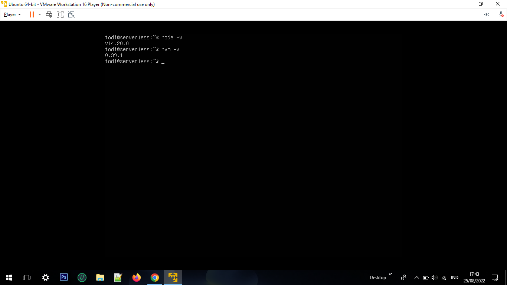

# Application in Server

1. NodeJs

   - Install engine javascript V8
   `curl -o- https://raw.githubusercontent.com/nvm-sh/nvm/v0.38.0/install.sh | bash`
   - Jalan perintah ini jika nvm belum terdeteksi `exec bash`
   
   

      
   

   
   - Ketik perintah berikut untuk install npm
   `npm install 14`
   - Untuk mengecek versi dari nodejs dan  `node -v` `npm -v`
   - Selanjutnya inisiasi project `npm init -y`
   - Install framework Express JS sebagai backend 
   `npm install express --save`
   - Buat sebuah file index.js
   `nano index.js`
   - Jalankan program file index.js
   `node index.js`
   - Buka browser akses IP dengan port `3000` 
   

2. Golang
3. Python

. golang

pertama install golang

`sudo apt-get install golang-go`

. python
