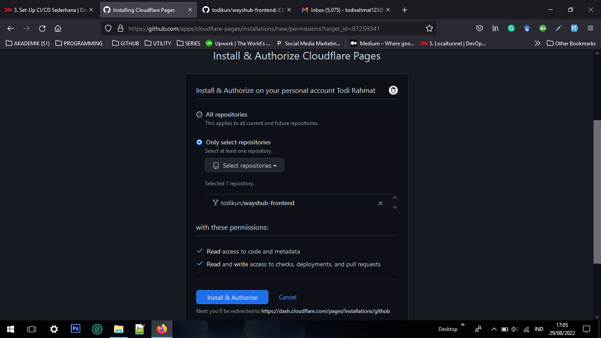
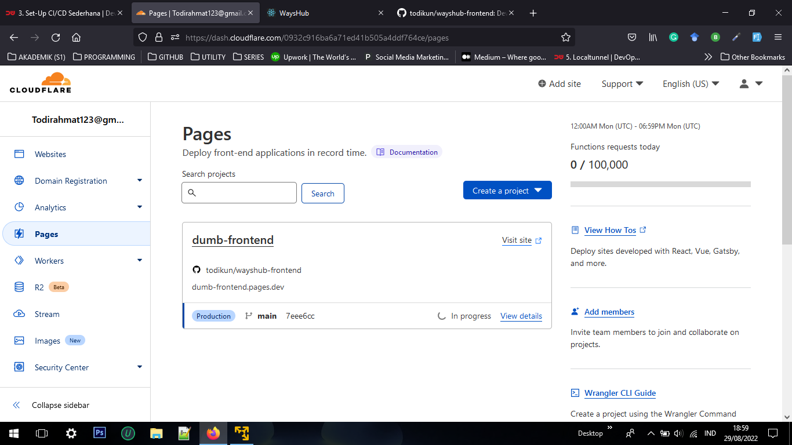

# CI/CD with Cloudflare Pages

Daftar Isi :
  1. [Ubuntu Server](https://github.com/todikun/dev-ops/tree/main/ubuntu-server)
  2. [Localtunnel](https://github.com/todikun/dev-ops/tree/main/localtunnel)
  3. [Simple Application in Server](https://github.com/todikun/dev-ops/tree/main/application-in-server)
  4. [Version Control System](https://github.com/todikun/dev-ops/tree/main/vcs-basic)
  5. [CI/CD with Cloudflare Pages](https://github.com/todikun/dev-ops/tree/main/cicd-with-cloudflare)
  6. [Manage Server with Terminal](https://github.com/todikun/dev-ops/tree/main/manage-server-with-terminal)
  7. [Web Server & Load Balancing](https://github.com/todikun/dev-ops/tree/main/web-server-load-balancing)
---
> Repository [Here](https://github.com/todikun/wayshub-frontend), Web Pages [Here](https://dumb-frontend.pages.dev/login)

Ctt : Login [Cloudflare](https://cloudflare.com/), jika belum punya akun silahkan registrasi terlebih dahulu [Cloudflare](https://cloudflare.com/sign-up)

### 1. Cloudflare Pages
   - Masuk kemenu **pages** untuk membuat project baru
   
   

    
   

   
   - Klik **Connect To Github**, agar repository di github dapat terdeteksi di **Cloudflare Pages**
   - Pilih akun github
   
   

    
   

   
   - Pilih **Only select repositories** karena kita akan menghubungkan **Cloudflare Pages** ke salah satu repositories saja
   
   

    
   

   
   - Klik **Begin setup** untuk memulai konfigurasi
   
   

    
   

   
   - Isi nama project dan pilih branch
   
   

    
   

   
   - Pilih **Framework preset**
   
   

    
   

   
   - Selanjutnya klik **Save and deploy**
   - Tunggu proses build sampai selesai
   
   

    
   

   
   

    
   

   
   - Selanjutnya buka url yang ada di sebelah **Domains**
   

    
   

   
### 2. Update code

   - Buka ubuntu server di VMWare
   - Lakukan clone repository `git clone <repository>`
   
   

    
   

   
   - Kita akan mengubah `title` di file **index.html**
   
   

    
   

   
   - Melakukan push repository
   
     `git add . `

     `git commit -m "update index.html"`

     `git push origin main`
   
   

    
   

   
   - Selanjutnya **Cloudflare** akan ke trigger untuk melakukan build ulang ketika ada perubahan yang terjadi pada repository
   
   

    
   

   
   

    
   

   
   - Tunggu proses build nya sampai selesai
   
   

    
   

   
   - **Title** pada web pages telah berubah
   
   

    
   

   
   
   
   
   
   
 
