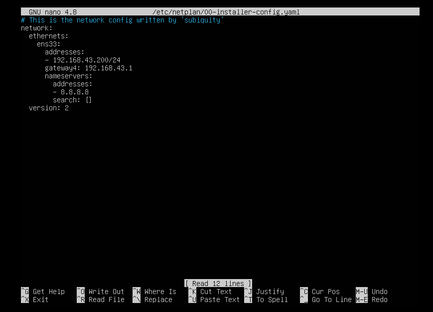
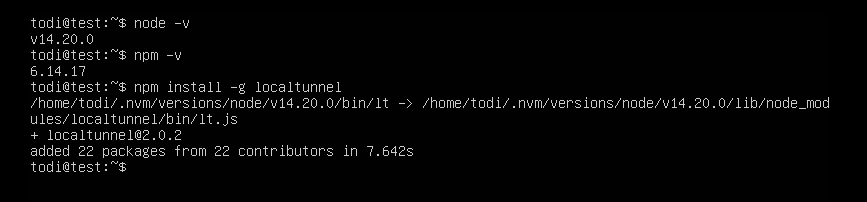
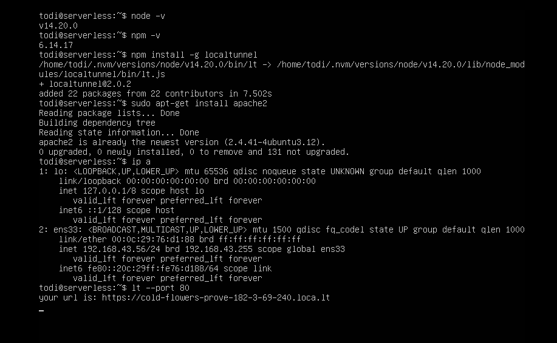
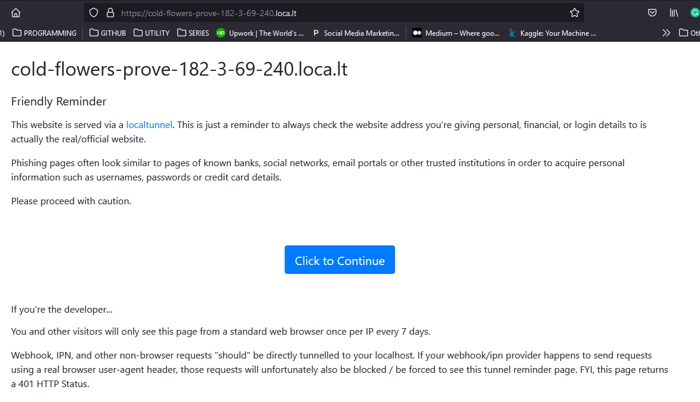
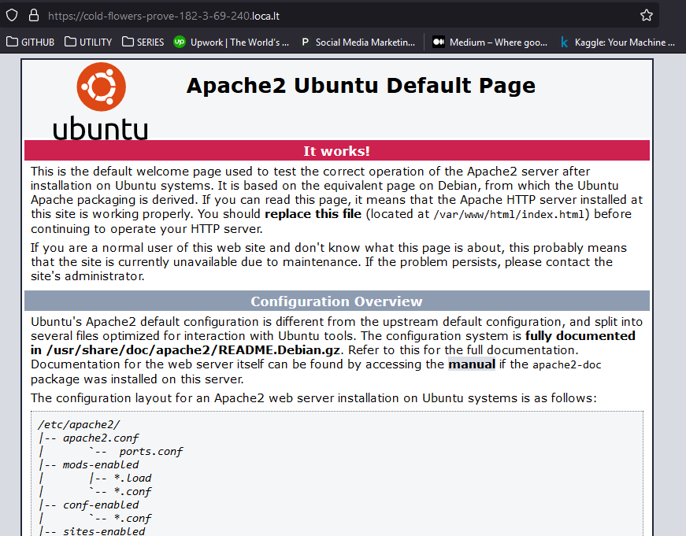

# Localtunnel

Daftar Isi :
  1. [Ubuntu Server](https://github.com/todikun/dev-ops/tree/main/ubuntu-server)
  2. [Localtunnel](https://github.com/todikun/dev-ops/tree/main/localtunnel)
  3. [Simple Application in Server](https://github.com/todikun/dev-ops/tree/main/application-in-server)
  4. [Version COntrol System](https://github.com/todikun/dev-ops/tree/main/vcs-basic)
  5. *SOON!*
---
Sebelum lanjut ke Localtunnel, kita coba ganti IP lama dengan baru karena koneksi yang dipilh sebelumnya pada sesi installasi **Ubuntu Server** static maka perlu di konfigurasi ulang.
  
Caranya:
  - Gunakan perintah berikut
    
    `sudo nano /etc/netplan/00-installer-config.yaml`
    
    

        
    

  
  - Selanjutnya untuk keluar dari teks editor ini bisa menggunakan **ctrl + x** lalu **Y** setelah itu Enter
  - Ketik perintah berikut untuk mengkonfirmasi customisasi dari **IP** yang telah dirubah tadi
    
    `sudo netplan apply`
    
  - Selanjutnya ketik perintah dibawah untuk memastikan terhubung dengan internet
    
    `ping google.com`
    
    

        
    

    
---
Instal localtunnel agar server local dapat diakses secara publik.
  - Install **node.js** dan **nvm**
  
    `sudo apt-get curl`
    
    `curl -o- https://raw.githubusercontent.com/nvm-sh/nvm/v0.39.1/install.sh | bash`
  
  - exec bash

    `nvm install 14`

    `node -v`

    `npm -v`
    
    

        
    

    
    

        
    

    
  -  Selanjutnya install **Localtunnel** dengan **npm**
  
     `npm install -g localtunnel`
     
     

        
     

    
  - Install **Apache2** 
  
    `sudo apt-get install apache2`
    
    

        
    

    
  - Ketik **Y** jika muncul notifkasi
  
  - Untuk menjalankan localtunel ketik perintah di bawah ini
    
    `lt --port 80`
    
    

        
    

    
  - Selanjutnya akses via web browser
    
    

        
    

    
  - Klik Continue
  - Sekarang aplikasi sudah dapat diakses secara publik.
  
    

        
    

    
    
