# Manage Server With Terminal
Daftar Isi :
  1. [Ubuntu Server](https://github.com/todikun/dev-ops/tree/main/ubuntu-server)
  2. [Localtunnel](https://github.com/todikun/dev-ops/tree/main/localtunnel)
  3. [Simple Application in Server](https://github.com/todikun/dev-ops/tree/main/application-in-server)
  4. [Version Control System](https://github.com/todikun/dev-ops/tree/main/vcs-basic)
  5. [CI/CD with Cloudflare Pages](https://github.com/todikun/dev-ops/tree/main/cicd-with-cloudflare)
  6. [Manage Server with Terminal](https://github.com/todikun/dev-ops/tree/main/manage-server-with-terminal)
  7. *SOON!*
---
## 1. Terminal
Terminal merupakan tools yang sangat penting untuk dipahami, karena pada server berbasis unix/linux tidak ada GUI untuk 
diklik klik dalam menjalankan server.
      
### Text Editor  
Text editor sangat penting dipelajari karena akan membantu kita dalam membuat sebuah konfigurasi tertentu.
  
- **Nano**
          
  - Membuat sebuah file
            
    `nano test.md`
            
    

      
    

            
    

      
    

   - Memilih teks

     `ALT + A`

    

      
    

    - Copy & Paste

      `ALT + 6` untuk mengcopy
      
      `ALT + U` untuk paste

    

      
    

    - Move cursor

      `CTRL + A` pindah cursor ke baris awal
      
      `CTRL + E` pindah cursor ke baris akhir

    

      
    

    

      
    

### Text Manipulation

- **cat**

`cat` sebuah perintah untuk melihat isi dari sebuah file

  

    
`cat > (namafile)` untuk membuat sebuah file baru dan memasukkan teks

  

- **grep**

Akan mencari dan menghitung kata saya di file test.md 

`grep -c **saya** test.md`

  

---
### Monitoring

Monitoring penting karena kita dapat memantau keadaan server, seperti apakah server tersebut resource nya masih aman, atau server tersebut masih bagus atau ada yang down.

`htop`

  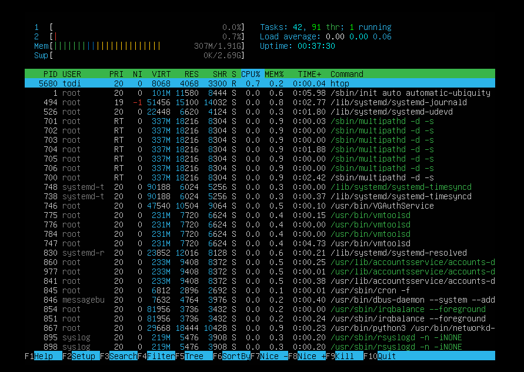

Nmon

`sudo apt-get install nmon`

  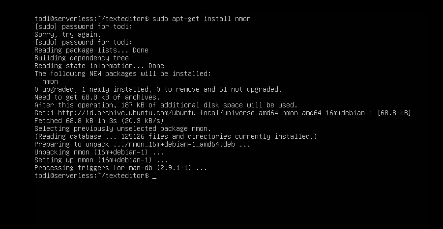

untuk menjalakankannya

`nmon`

  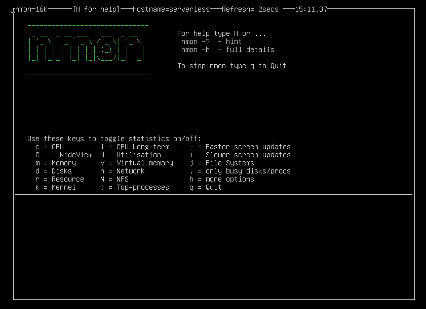

  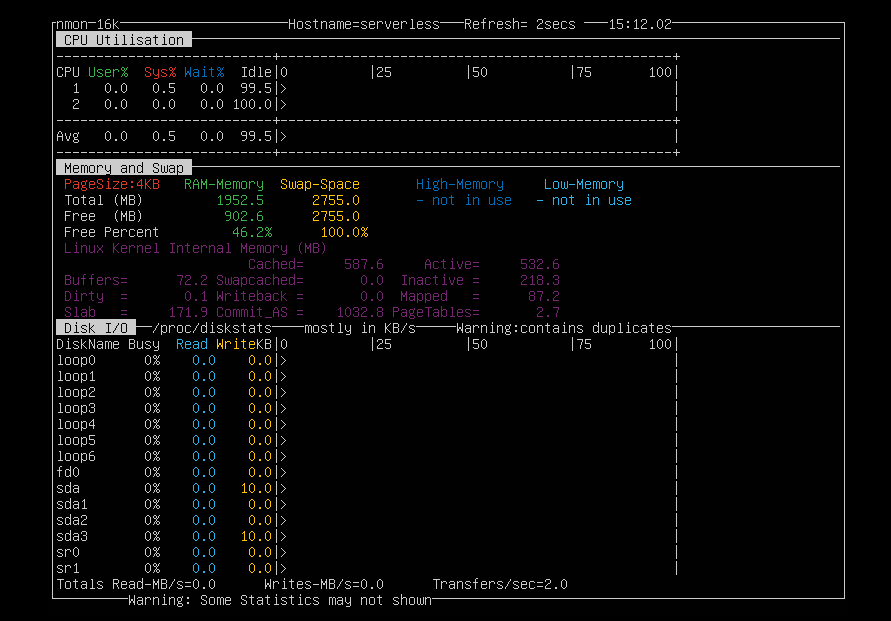

### Netwwork Firewall
 
Firewall merupakan garis pertahanan pertama dalam menjaga keamanan jaringan komputer.

- Ufw 
  
  `sudo apt-get install ufw -y`
  

  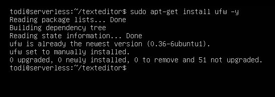

- Untuk menampilkan aplikasi yang didukung oleh ufw pada server

`sudo ufw app list`
  

  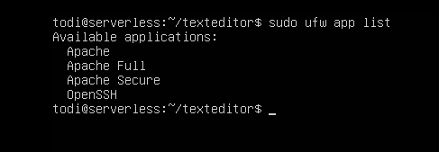

## File bash

- Membuat file bash yang berisi script untuk melakukan update & upgrade system

  `nano update-system.sh`

  

    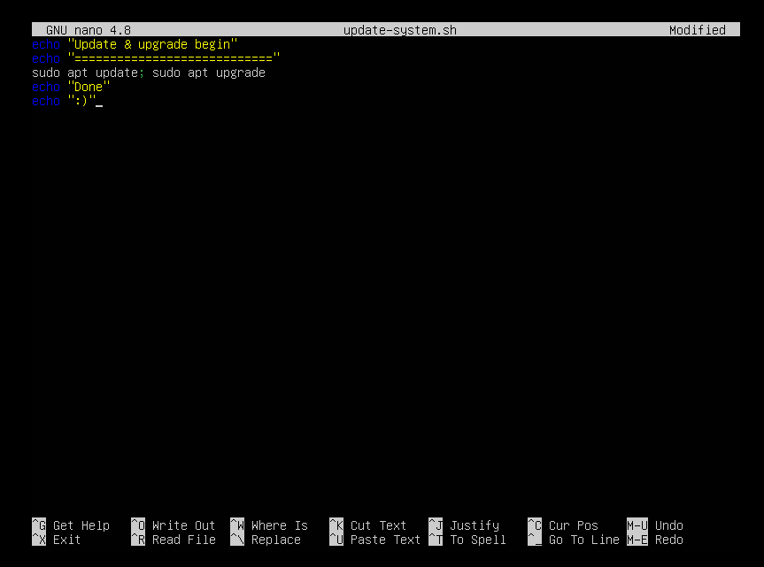
  

  - Ketik perintah berikut untuk mengeksekusi

  `bash update-system.sh`

  

    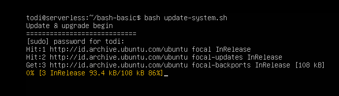
  

  

    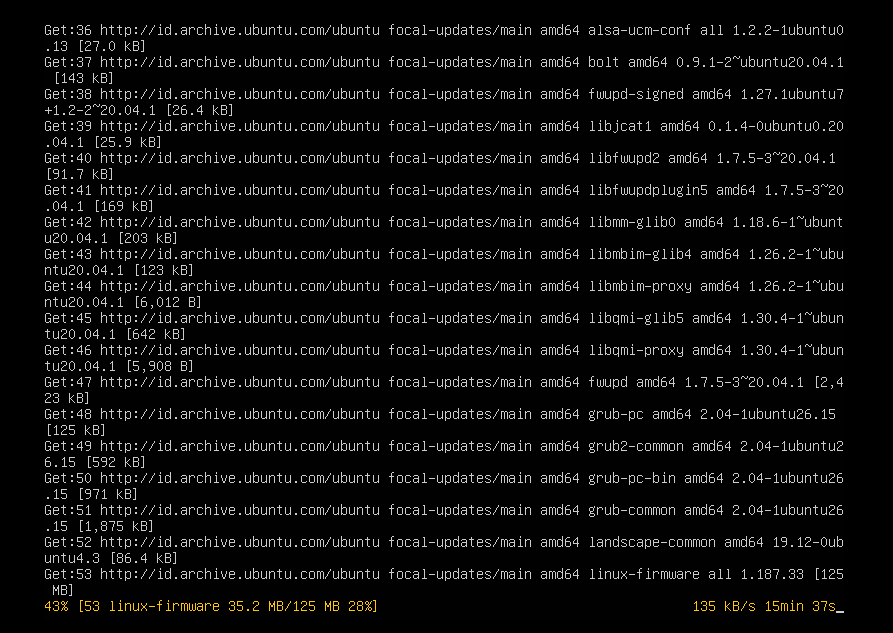
  

- Membuat file bash untuk membuat firewall port 22, 80 dan 443
  
  - Aktifkan ufw
  
    `sudo ufw enable`
    
  - Ketik perintah `sudo ufw verbose` untuk melihat status ufw
  
  

    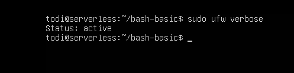
  

  
  - Buat sebuah file bash `nano ufw-port.sh`
  
  

    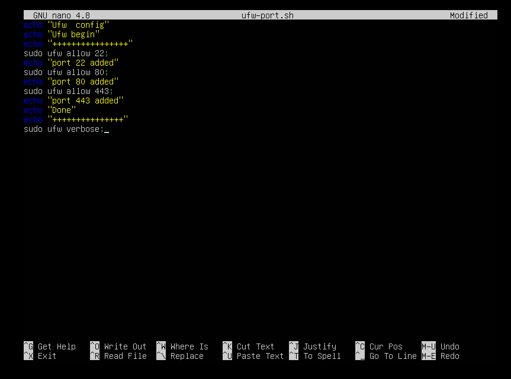
  

  
  - Ketik perintah berikut untuk mengeksekusi file bash `bash ufw-port.sh`
  
  

    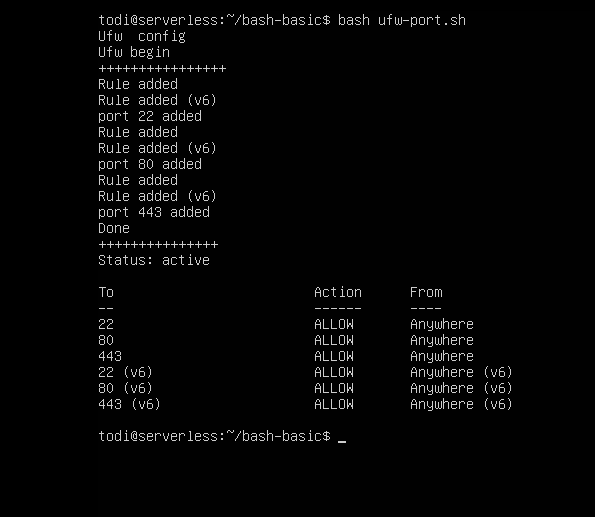
  

  
  - Terakhir kita akan membuat file bash untuk mematikan firewall port 22, 80, 443
  
  
  

    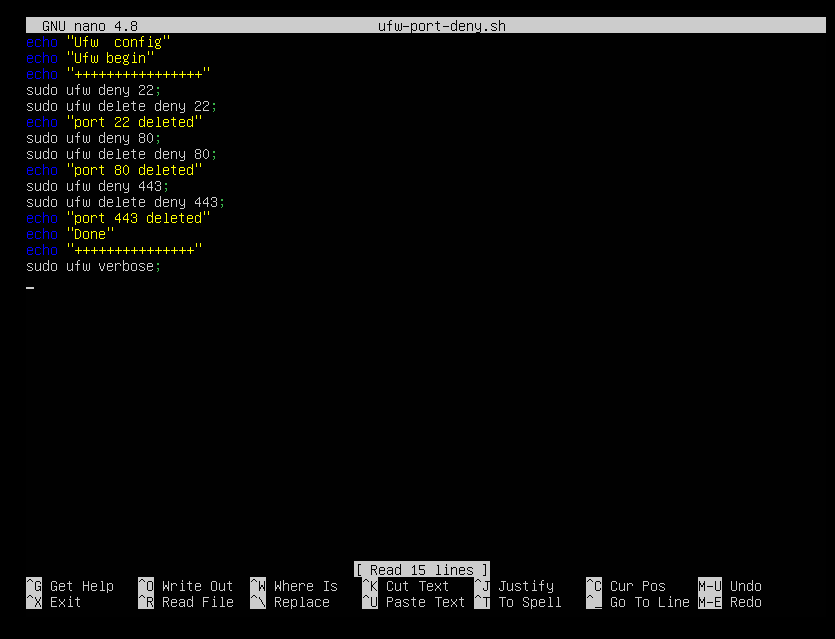
  

  

    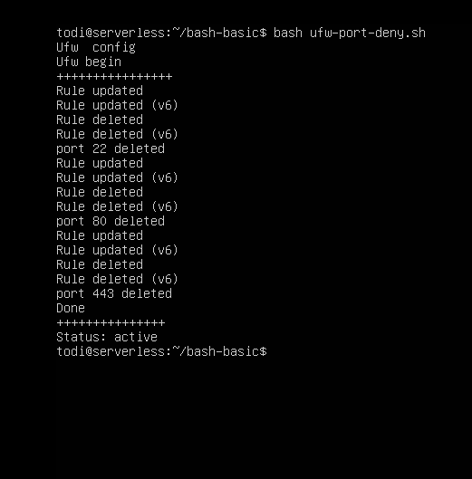
  

        
