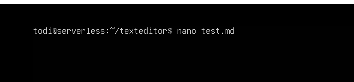
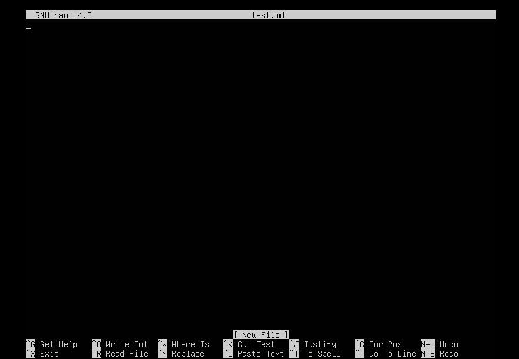
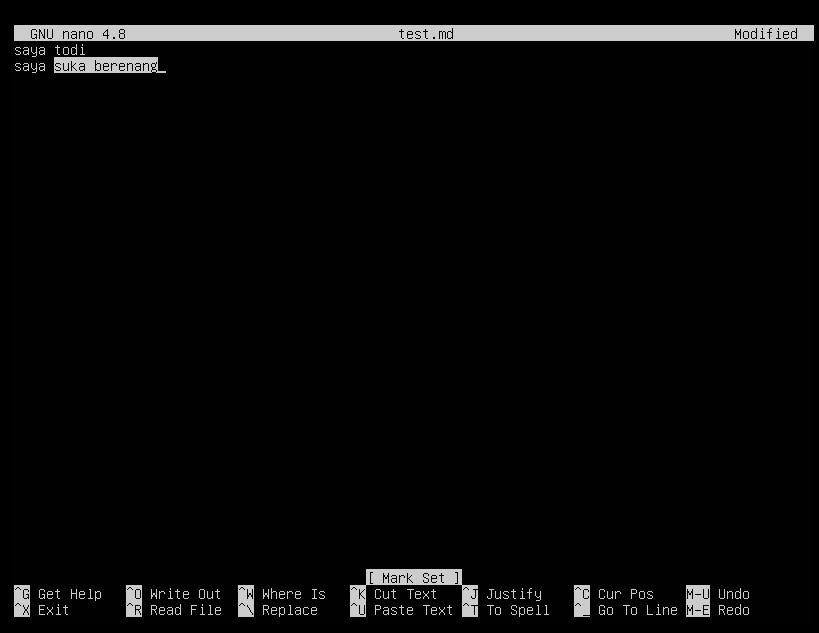
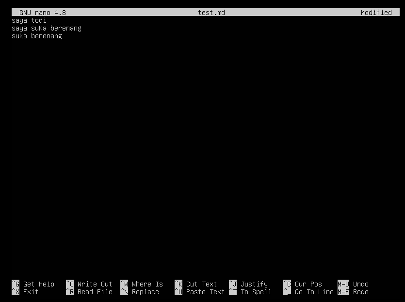
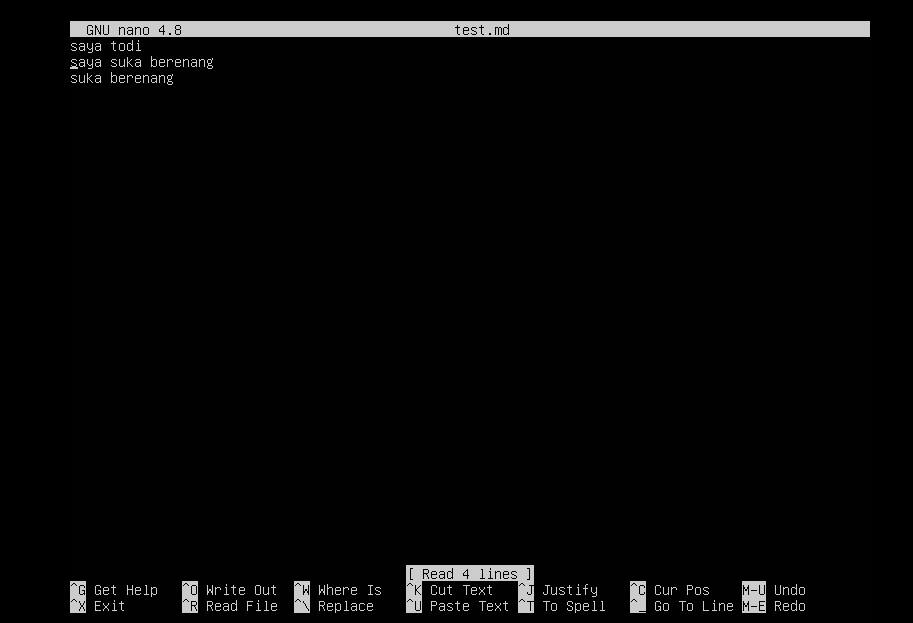
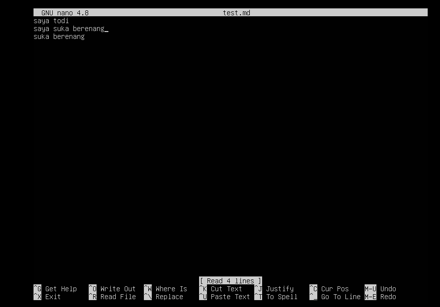
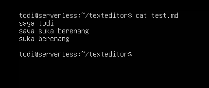
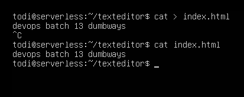
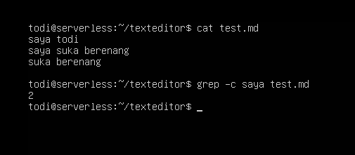

# Manage Server With Terminal
Daftar Isi :
  1. [Ubuntu Server](https://github.com/todikun/dev-ops/tree/main/ubuntu-server)
  2. [Localtunnel](https://github.com/todikun/dev-ops/tree/main/localtunnel)
  3. [Simple Application in Server](https://github.com/todikun/dev-ops/tree/main/application-in-server)
  4. [Version Control System](https://github.com/todikun/dev-ops/tree/main/vcs-basic)
  5. [CI/CD](https://github.com/todikun/dev-ops/tree/main/vcs-basic)
  6. [Manage Server with Terminal](https://github.com/todikun/dev-ops/tree/main/manage-server-with-terminal)
  7. *SOON!*
---
## 1. Terminal
Terminal merupakan tools yang sangat penting untuk dipahami, karena pada server berbasis unix/linux tidak ada GUI untuk 
diklik klik dalam menjalankan server.
      
### Text Editor  
Text editor sangat penting dipelajari karena akan membantu kita dalam membuat sebuah konfigurasi tertentu.
  
- **Nano**
          
  - Membuat sebuah file
            
    `nano test.md`
            
    

      
    

            
    

      
    

   - Memilih teks

     `ALT + A`

    

      
    

    - Copy & Paste

      `ALT + 6` untuk mengcopy
      
      `ALT + U` untuk paste

    

      
    

    - Move cursor

      `CTRL + A` pindah cursor ke baris awal
      
      `CTRL + E` pindah cursor ke baris akhir

    

      
    

    

      
    

---
### Text Manipulation

- **cat**

`cat` sebuah perintah untuk melihat isi dari sebuah file

  

    
`cat > (namafile)` untuk membuat sebuah file baru dan memasukkan teks

  

- **grep**

Akan mencari dan menghitung kata saya di file test.md 

`grep -c **saya** test.md`

  

---
### Monitoring

 

        
