# Instalasi Ubuntu Server di VMware

Sebelum lebih jauh membahas instalasi Ubuntu Server pastikan PC/Laptop kita sudah mendukung teknologi virtualisasi untuk mengecek nya ada beberapa cara : 

1. **Command Prompt** 

    >systeminfo

    Selanjutnya akan tampil informasi **Hyper-V Requirements** seperti gambar berikut

    

        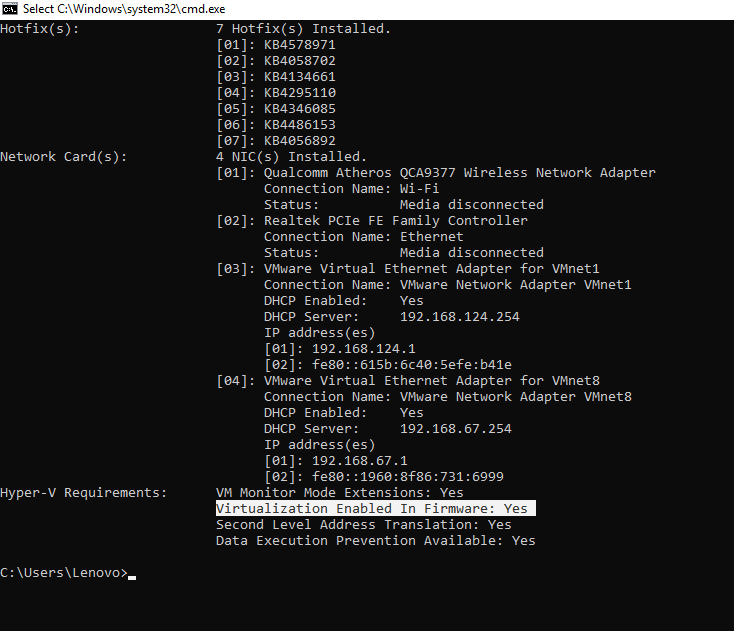
    

    
2. **LeoMoon CPU-V** 

    link download [Here!](https://leomoon.com/downloads/desktop-apps/leomoon-cpu-v/)

    Pastikan AMD-v Supported dan AMD-v Enabled ceklis seperti gambar berikut 
    > Note : INTEL VT (untuk pengguna INTEL)

    

        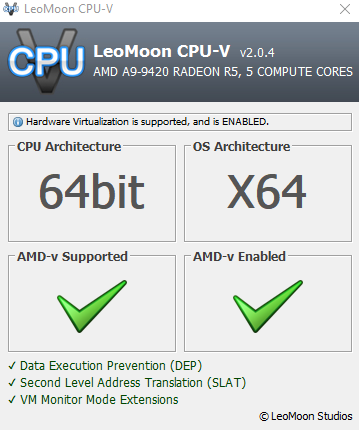
    

    
    > Jika AMD-v Enabled nya tidak ceklis jangan khawatir itu hanya karena Teknologi Virtualisasinya belum enable.
    > 
    > Tutorial enable Teknologi Virtualisasi [Here!](https://www.leskompi.com/cara-mengaktifkan-virtualization-processor/)
    
---
### Tutorial Instal Ubuntu Server di VMWare
- Buka aplikasi VMware klik Create a New Virtual Machine.    
- Pilih Installer disc image file, dan cari file OS Ubuntu Server

    

        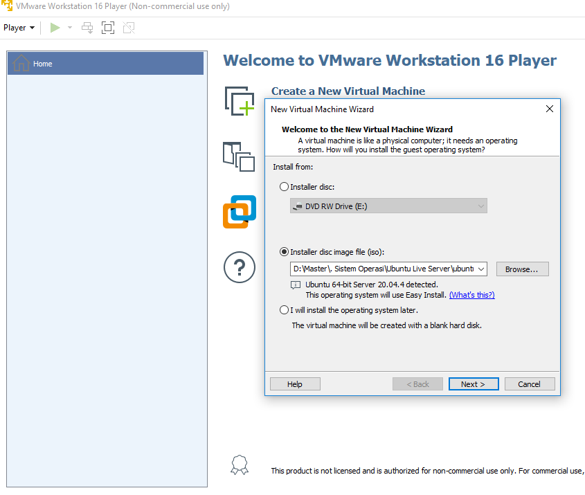
    

    
- Isi Fullname, username dan password
- Buat nama virtual machine dan tentukan lokasi path virtual machine

    

        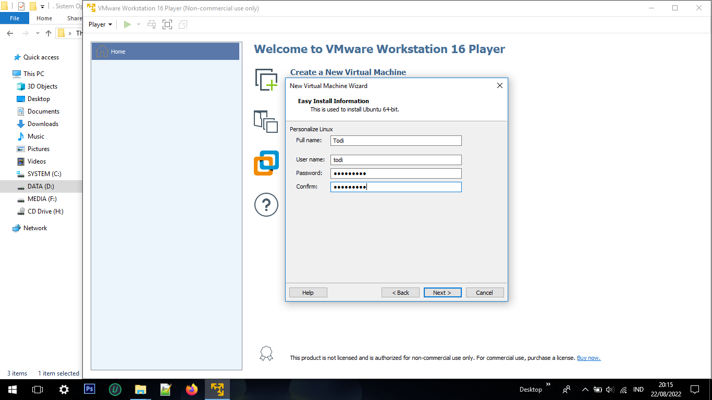
    

    
    

        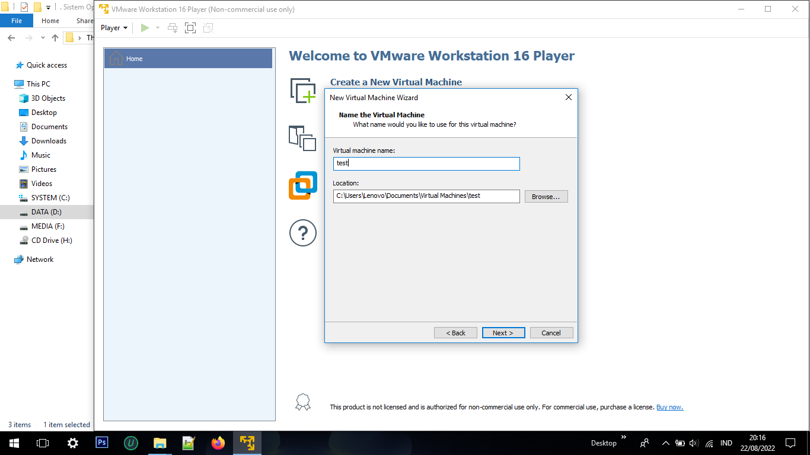
    

    
- Isi jumlah kapasitas disk yang diinginkan, dan ceklis **Split virtual disk into multiple files.** maksudnya disk yang kita pakai untuk virtual machine kita nantinya akan dibagi menjadi beberapa bagian 

    

        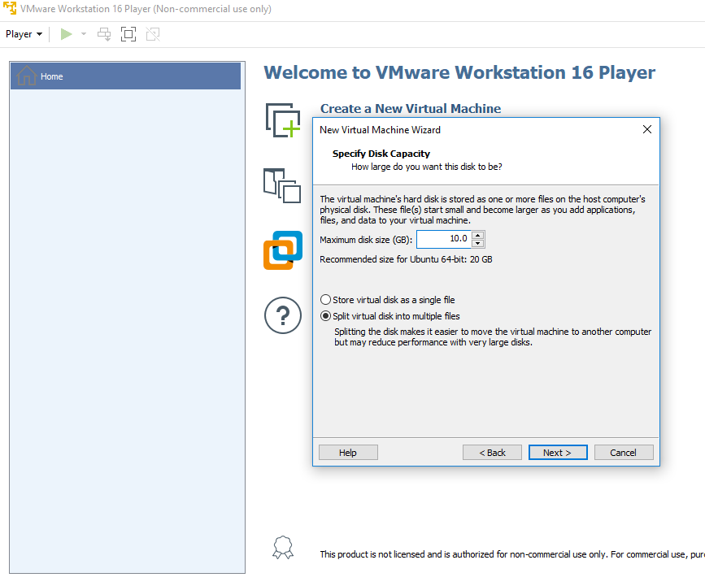
    

    
-  Klik Customize Hardware klik bagian Network Adapter ubah menjadi **Bridge** 
-  Klik Finish
    
    

        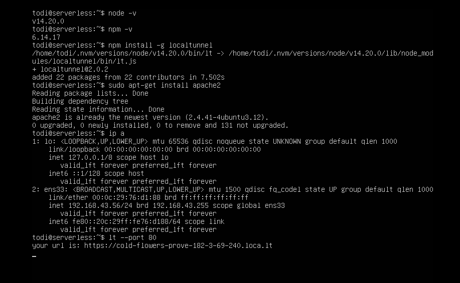
    

    
    

        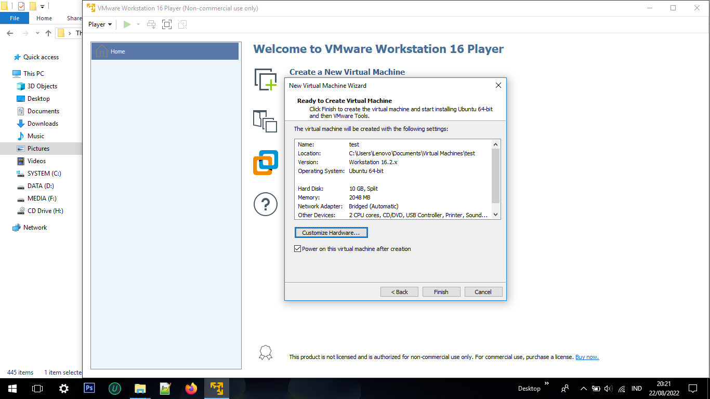
    

    
- Nanti langsung diarahkan ke proses intalasi

    

        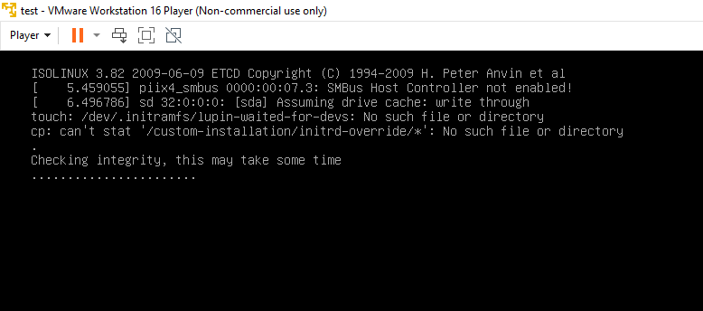
    

    
- Pilih bahasa yang diinginkan **English**

    

        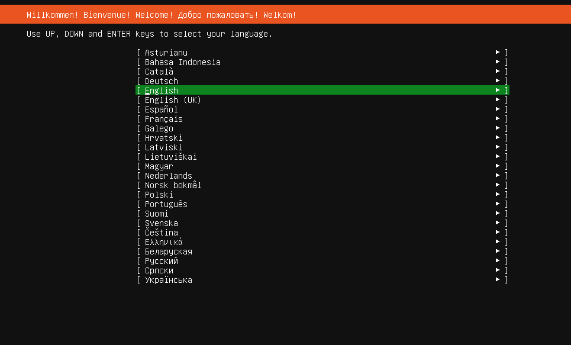
    

    
- Selanjutnya bisa klik done

    

        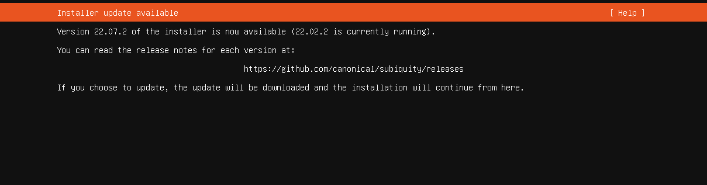
    

    

        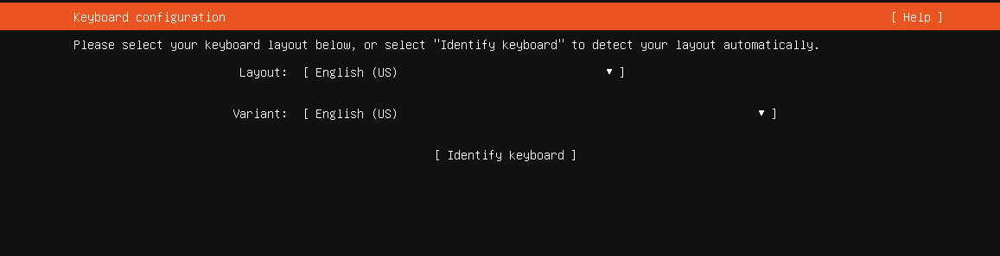
    

    
- Ubah konfigurasi DHCPv4 menjadi Static
- Pilih ens33, pada bagian IPv4 Method ubah automatic menjadi manual.
- Masukan detail IP, sesuaikan dengan IP dari koneksi jaringan yang dipakai

    

        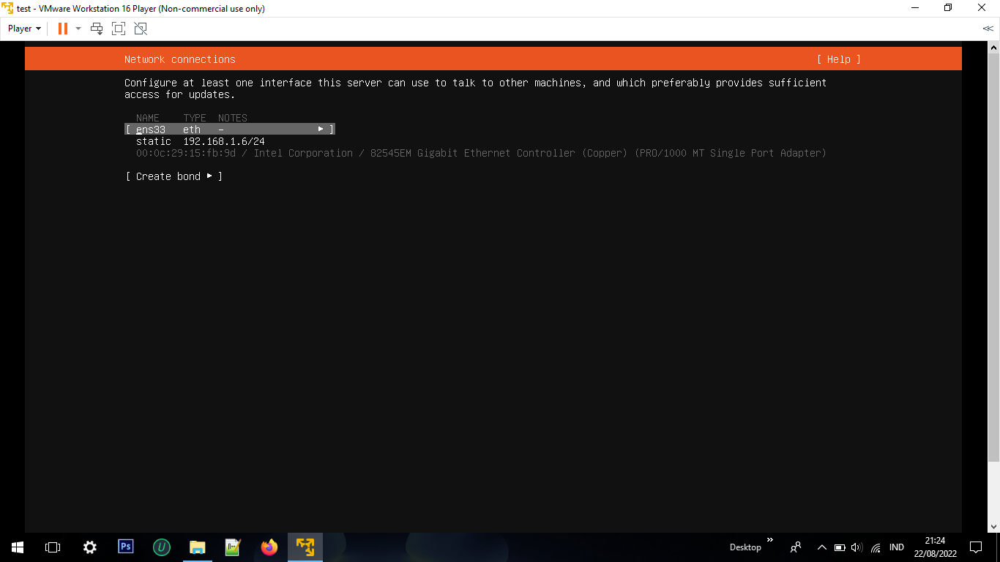
    

    

        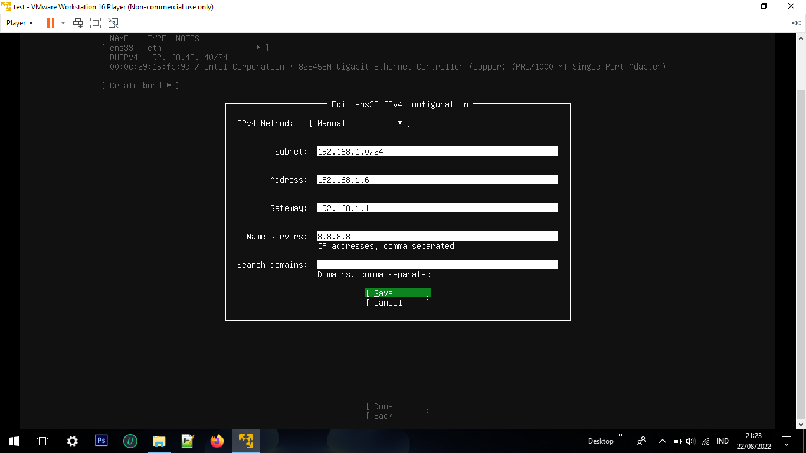
    

    
- Pada tahap selanjutnya bisa skip lagi dengan klik **Done**.

    

        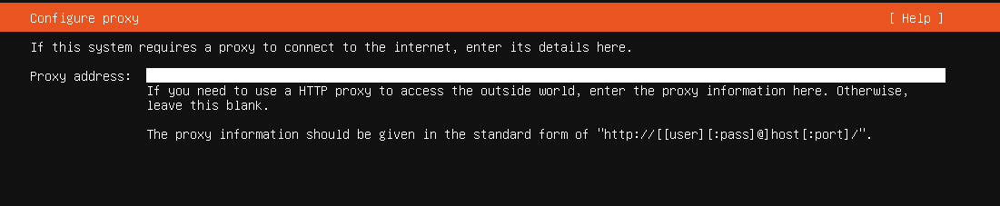
    

    

        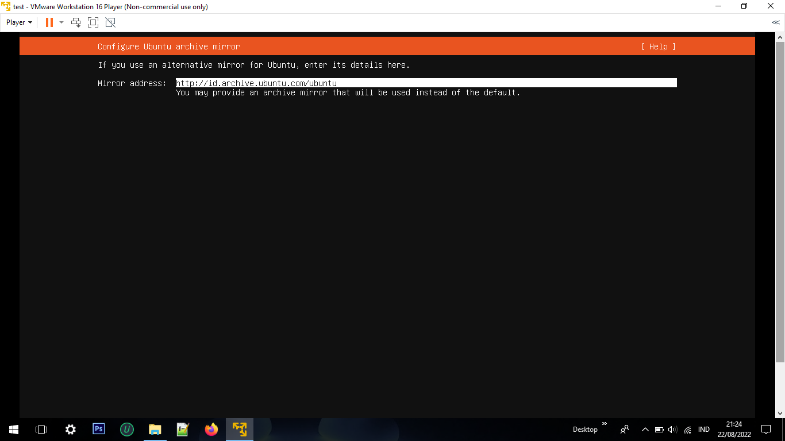
    

    
- Pilih **Custom storage layout**. Disini kita akan buat 2 partisi untuk **root** dan **swap**
- Pilih free space Klik ADD GPT Partition
- Atur ukuran space untuk swap dan root
- Klik Done.
- Klik Continue ketika muncul notifikasi konfigurasi yang telah dibuat.
    

        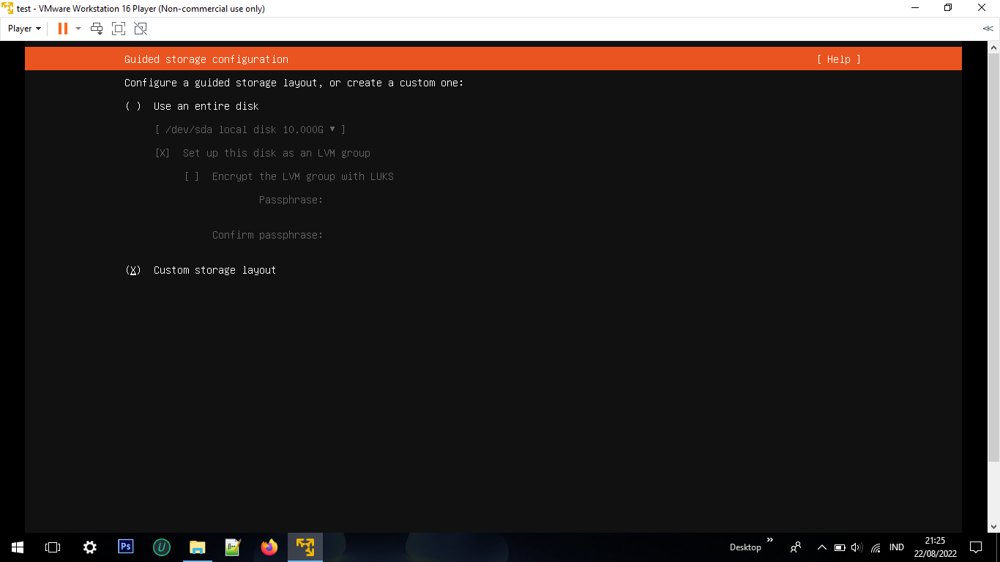
    

    

        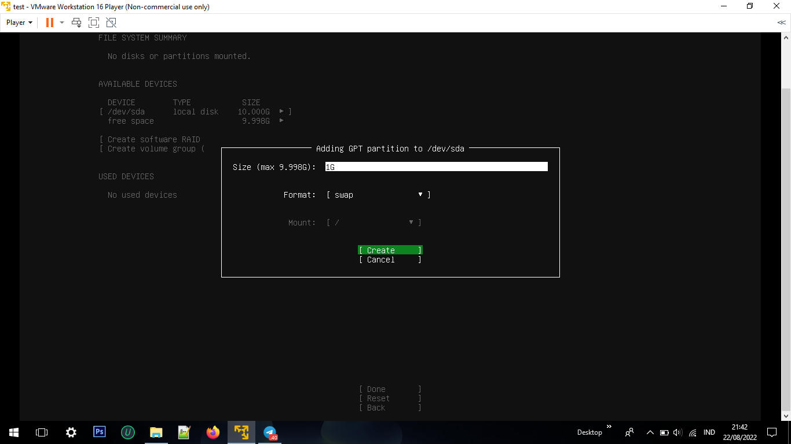
    

    

        
    

    

        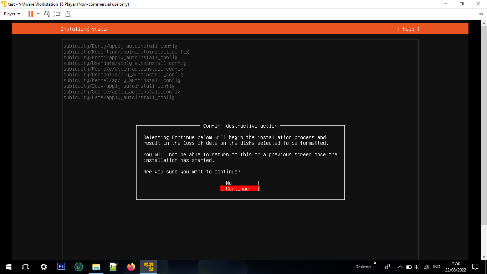
    

    
