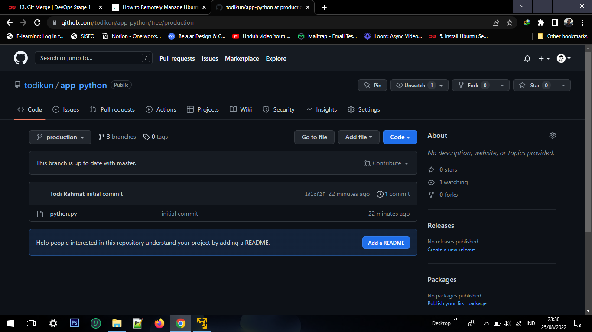

# Version Control System

Daftar Isi :
  1. [Ubuntu Server](https://github.com/todikun/dev-ops/tree/main/ubuntu-server)
  2. [Localtunnel](https://github.com/todikun/dev-ops/tree/main/localtunnel)
  3. [Simple Application in Server](https://github.com/todikun/dev-ops/tree/main/application-in-server)
  4. [Version Control System](https://github.com/todikun/dev-ops/tree/main/vcs-basic)
  5. [CI/CD with Cloudflare Pages](https://github.com/todikun/dev-ops/tree/main/cicd-with-cloudflare)
  6. [Manage Server with Terminal](https://github.com/todikun/dev-ops/tree/main/manage-server-with-terminal)
  7. [Web Server & Load Balancing](https://github.com/todikun/dev-ops/tree/main/web-server-load-balancing)
---
### Python [Here](https://github.com/todikun/app-python), Golang [Here](https://github.com/todikun/app-golang), dan NodeJS [Here](https://github.com/todikun/app-nodejs).
   - Masuk ke directory project
   - Ketik perintah `git init` agar git dapat menginisiasi project kita
   
   

      
   

   
   - Ketik perintah :
   `git add .`
   `git commit -m "initial commit"`
   - Untuk memastikan bahwa project telah diinisasi ketik perintah berikut `git status`
   
   

      
   

   
   - Selanjut nya agar project dapat di upload ke repository di github, buat sebuah repositroy 
   
   

      
   

   
   - Buat remote
   `git remote add origin git@github.com:todikun/app-python.git`
   
   - Upload repository 
   `git push origin master` 
   
   

      
   

   
   - Buat branch staging
   `git branch staging`
   
   - Pindah branch
   `git checkout staging`
   
   - Untuk memastikan apakah branch sudah berganti ketik perintah berikut
   `git branch -a`
   
   

      
   

   
   - Lakukan pull agar branch staging dapat update commit terbaru dari branch master
   `git pull origin master`
   
   

      
   

   
   - Selanjutnya lakukan push
   `git push -u origin staging`
   
   

      
   
   
   
   

      
   
   
   
   

      
   

   
   - Buat branch baru dengan nama production
   `git branch production`
   `git checkout production`
      
   

      
   

   
   - Terakhir kita akan menggabungkan branch master ke branch production
   `git merge master`
   - Lakukan push
   `git push origin production`
        
   

      
   
 
